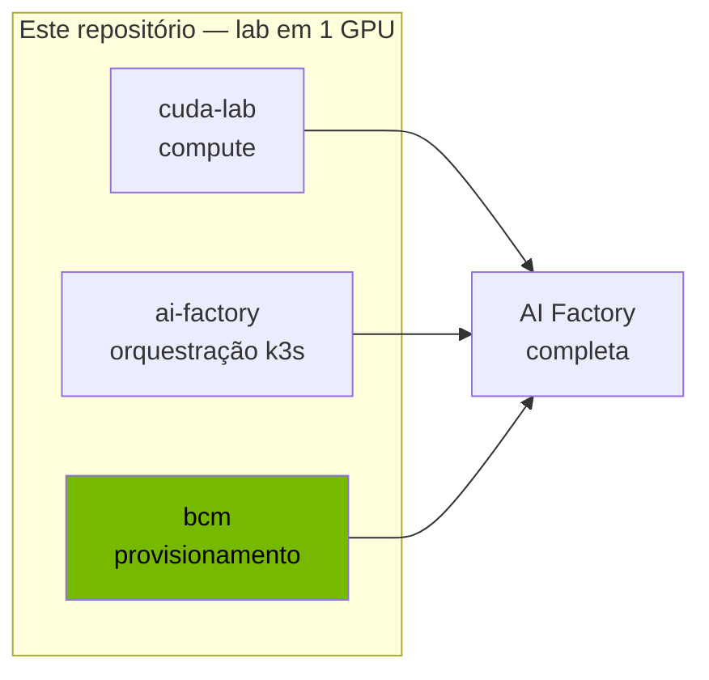
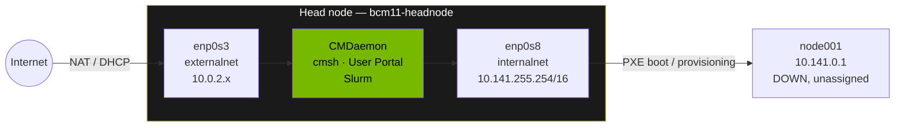
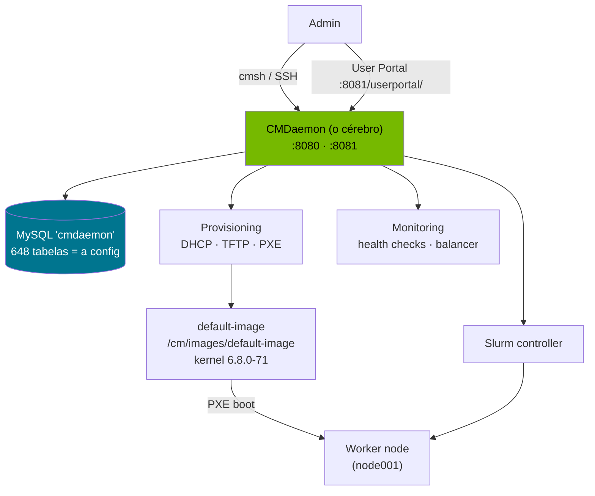
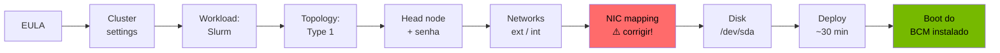
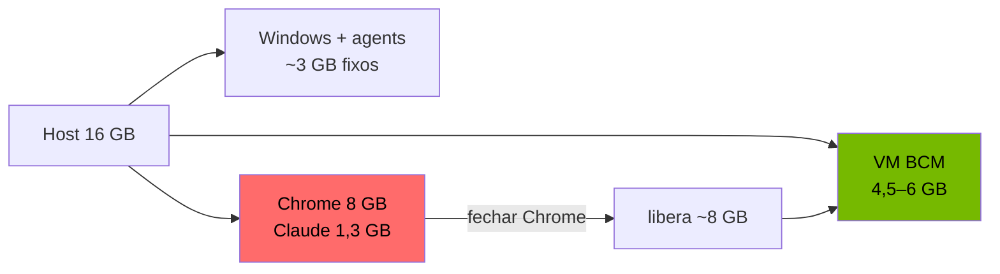
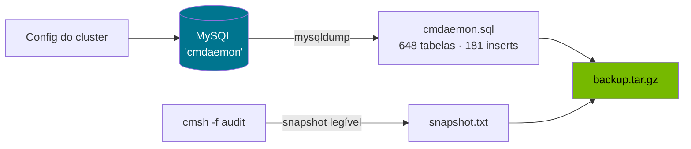
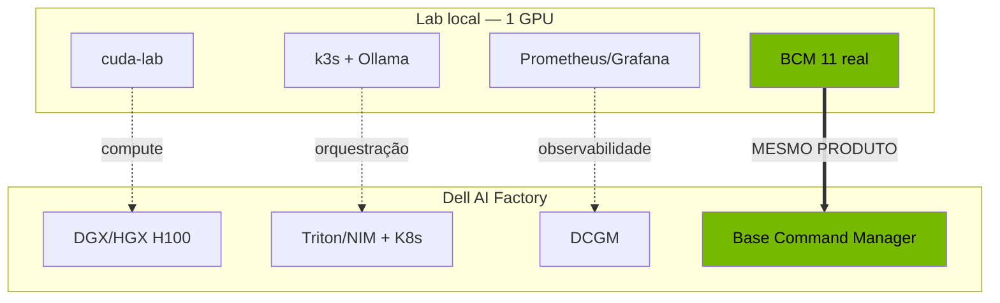

# BCM 11 num único host — deep dive de campo

> Instalando, operando e fazendo backup do **NVIDIA Base Command Manager 11.0** — o mesmo produto que a Dell e a NVIDIA usam para entregar AI Factories — numa única máquina, em escala de laboratório. Com as descobertas que **não estão nos guias**.

```
┌──────────────────────────────────────────────────────────────┐
│  NVIDIA Base Command Manager 11.0  ·  Ubuntu 24.04            │
│  Head node UP  ·  Slurm  ·  cmsh  ·  User Portal  ·  backup   │
│  "running in active master mode"                             │
└──────────────────────────────────────────────────────────────┘
```

**TL;DR** — Subi um head node BCM de verdade (não um análogo open-source), provei a operação ponta a ponta (`cmsh`, User Portal, Slurm, provisioning), e descobri na marra que o BCM 11 **trocou o backup de `configurationdump` por mysqldump do banco do CMDaemon**. Tudo num laptop de 16 GB, com engenharia de restrição de recursos no meio do caminho.

---

## 1. Por que isto importa

O BCM (ex-Bright Cluster Manager) é a **camada de provisionamento e gestão** de uma AI Factory: instala o head node, faz PXE boot dos worker nodes, gerencia imagens de software, sobe o workload manager e monitora o cluster. É o que transforma um amontoado de PowerEdge + GPU em um cluster utilizável.

Muita gente — mesmo dentro de fornecedores — só vê o BCM **do lado de fora**. Este deep-dive é de dentro: instalação bare-metal, o shell `cmsh`, o banco do CMDaemon, e a operação real.



---

## 2. Hardware — em detalhe

A escolha de rodar tudo num laptop não foi só economia: foi **engenharia de restrição**, que é exatamente o que acontece em campo quando o sizing é apertado.

### 2.1 Máquina host

| Componente | Especificação | Observação |
|---|---|---|
| **CPU** | Intel Core **i7-13650HX** (Raptor Lake) | 14 núcleos (6P + 8E) / **20 threads** — sobra de CPU |
| **RAM** | **16 GB DDR5** | **o gargalo** de todo o lab |
| **GPU** | NVIDIA **RTX 3050 6GB** Laptop (Ampere GA107, compute 8.6) | **não usada na VM** — sem passthrough |
| **Storage** | SSD **NVMe** | disco dinâmico da VM cresce aqui |
| **OS / Hypervisor** | Windows 11 Home + **VirtualBox 7.1.6** | Home não tem Hyper-V Manager → VirtualBox |

> Ponto fino: Windows Home + WSL2 já ativam o Windows Hypervisor Platform, então o VirtualBox 7 **convive** com o WSL2 (com pequena perda de performance). Não precisa escolher entre os dois.

### 2.2 A VM do head node

| Parâmetro | Valor | Por quê |
|---|---|---|
| **Firmware** | **EFI** | espelha o UEFI de um PowerEdge real |
| **vCPU** | 4 | suficiente para o CMDaemon + serviços |
| **RAM** | 6 GB → ajustada para **4,5 GB** | sob pressão do host de 16 GB |
| **Disco** | **VDI dinâmico de 60 GB** | cresce conforme a instalação (~9 GB usados) |
| **NIC 1** | **NAT** (`enp0s3`) | rede externa — internet via DHCP |
| **NIC 2** | **internal network** (`enp0s8`) | rede de **provisioning / PXE** |
| **BMC** | nenhum | VM não tem IPMI/iDRAC |
| **GPU** | nenhuma | head node real **também não** precisa de GPU |

### 2.3 O mapeamento que importa — VM de lab → PowerEdge real

Cada peça da VM tem um análogo direto num head node Dell de produção. **É aqui que o lab vira intuição de campo:**

| No lab (VirtualBox) | No PowerEdge real (campo Dell) |
|---|---|
| Firmware EFI | UEFI + Secure Boot configurável |
| VDI de 60 GB para o OS | **BOSS card** (2× M.2 em RAID 1) só para o OS |
| (sem disco de dados) | NVMe U.2/U.3 "raw" para dados/scratch |
| NIC NAT (externalnet) | porta de **management / uplink** ao cliente |
| NIC interna (internalnet) | rede de **provisioning** dedicada, untagged, PXE |
| "No BMC" | **iDRAC** (gestão out-of-band) |
| sem GPU no head | head node real **não** carrega GPU — GPU vive nos **worker nodes** |
| bond ausente (1 IP/NIC) | bond **ALB type 6**, MTU 9000 via bond-pai |

> Essa tabela é a ponte entre "instalei numa VM" e "entendo o deploy de um XE9680". O head node provisiona; os worker nodes (com as GPUs) é que treinam/inferem.

---

## 3. Topologia de rede

Network topology **Type 1**: os nós ficam numa rede interna privada e só falam com o mundo através do head node.



| Rede | Faixa | Papel |
|---|---|---|
| **externalnet** | `10.0.2.0/24` (DHCP via NAT) | internet do head node |
| **internalnet** | `10.141.0.0/16` (head = `.255.254`) | provisioning, PXE, gestão dos nós |
| **globalnet** | `cm.cluster` | namespace lógico interno |

> ⚠️ **Pegadinha do instalador:** o mapeamento das NICs veio **invertido** (externalnet na placa interna e vice-versa). Errar isso deixa o head sem internet e o PXE na rede errada. Sempre conferir a tela *Head node interfaces* — `enp0s3` (adaptador 1 = NAT) é a externalnet.

---

## 4. Como o BCM funciona por dentro

O coração é o **CMDaemon** (`cmd`). Tudo passa por ele: o `cmsh`, o User Portal, o provisioning, o monitoramento. A configuração inteira do cluster vive num **banco MySQL** local.



**O fluxo de provisioning** (o que a Dell entrega em campo):
1. Worker node liga e faz **PXE boot** na rede interna
2. CMDaemon entrega DHCP + a `default-image` via TFTP
3. O nó sobe com a imagem, vira "managed", entra no Slurm
4. Pronto para receber jobs

> No lab, o `node001` fica `DOWN, unassigned` — ele está **definido**, esperando um PXE boot. Bootá-lo de verdade exigiria uma 2ª VM simultânea, inviável em 16 GB. O fluxo é entendido; a execução fica para hardware maior.

---

## 5. A jornada de instalação

O instalador do BCM 11 é um wizard de ~18 telas. As decisões que importam:



Escolhas do lab: cluster `lab-cluster`, **Slurm**, **Type 1**, fuso `America/Sao_Paulo`, disco "One big partition", **BMC = No**, **CUDA desmarcado** (VM sem GPU).

---

## 6. Engenharia de restrição — a história do hardware apertado

Rodar BCM num host de 16 GB **com agents corporativos** (McAfee, ServiceShell, SupportAssist consomem ~3 GB intocáveis) é um exercício real de sizing:



**Sintomas reais e o que ensinam:**

| Sintoma | Causa | Lição de campo |
|---|---|---|
| `soft lockup: CPU#0 stuck 309s` | host paginando, VM sem CPU | sizing apertado degrada o guest silenciosamente |
| Boot travando no initramfs | RAM insuficiente no boot | power-off/on limpo recupera |
| `aborted` após reboot | host sem RAM no momento do reboot | reservar headroom para o host |

A correção foi reduzir a VM de 6 → 4,5 GB e fechar o navegador — **exatamente** o tipo de decisão de sizing que se toma num deploy real subdimensionado.

---

## 7. As descobertas de campo (o ouro)

São coisas que **contradizem os guias** ou que só se descobre operando:

### 7.1 O backup do BCM 11 mudou — `configurationdump` foi removido

Os guias antigos mandam:
```bash
cmsh -c "configurationdump -j /root/backup.json"   # ❌ não existe mais no BCM 11
```

No BCM 11 a config vive no **banco MySQL do CMDaemon**. O backup correto é:



Credenciais em `/cm/local/apps/cmd/etc/cmd.conf`. Script pronto: [`scripts/backup.sh`](scripts/backup.sh).

### 7.2 `cmsh -c` falha via SSH sem TTY → usar `cmsh -f`

```bash
ssh root@host 'cmsh -c "device list"'
# CMMain::verifyAPI, rpc: Couldn't resolve host name. → Not connected!
```
…mesmo com a rede 100% ok. **Workaround:** comandos num arquivo + `cmsh -f`. Ver [`scripts/run-cmsh-remote.ps1`](scripts/run-cmsh-remote.ps1).

### 7.3 User Portal exige barra final
```
https://localhost:8081/userportal   → 301 (parece "não carrega")
https://localhost:8081/userportal/  → 200 OK ✅
```

### 7.4 SSH com chave é o jeito profissional
Operar pela console do VirtualBox é inviável (sem paste, layout de teclado, sem Alt+Tab). Chave SSH + port forward = operação como em produção. Detalhes em [`notes/troubleshooting.md`](notes/troubleshooting.md).

---

## 8. Prova — estado real do cluster

Saída de `cmsh -f audit.cmsh` (sanitizada):

```
# device list
HeadNode      bcm11-headnode   10.141.255.254   internalnet   [ UP ]
PhysicalNode  node001          10.141.0.1       internalnet   [ DOWN ], unassigned

# softwareimage list
default-image   /cm/images/default-image   6.8.0-71-generic   1 node

# network list
externalnet   External   /24   10.0.2.0      (dhcp)
internalnet   Internal   /16   10.141.0.0    eth.cluster
```

**Backup real gerado:** `cmdaemon.sql` com **17.774 linhas · 648 tabelas · 181 inserts** — a configuração inteira do cluster, num pacote de 131 KB.

---

## 9. Onde isto se encaixa na AI Factory



As outras camadas do lab são **análogos** open-source. O BCM é a única onde o lab roda **o produto idêntico** ao de produção — só muda a escala.

---

## 10. O que isto prova

- Instalação e operação de um produto de cluster management **de verdade**, ponta a ponta
- Conhecimento de **operador** (backup via mysqldump, `cmsh -f`, sizing sob restrição) — não de manual
- A ponte entre "VM de lab" e "PowerEdge de campo" via o mapeamento de hardware
- Que a camada de provisionamento de uma AI Factory **cabe na cabeça** de quem a instalou na mão

**Próximos passos possíveis:** ativar a licença (`request-license`), submeter um job de teste no Slurm, e — com mais RAM — fazer o PXE boot real de um worker node.

---

📂 Scripts e notas completas neste diretório: [`scripts/`](scripts/) · [`notes/`](notes/)
🗺️ Panorama de todo o lab: [`../PANORAMA-NVIDIA-LAB.md`](../PANORAMA-NVIDIA-LAB.md)
