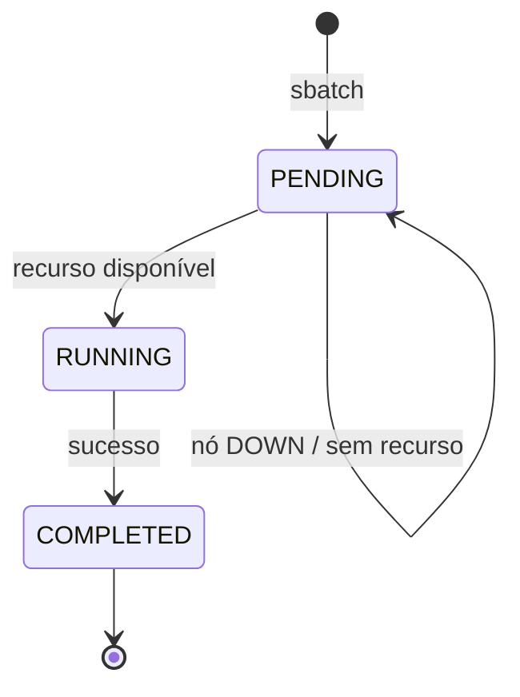

# Lab 01 — Slurm end-to-end no BCM (do job que pendura ao sweep de hiperparâmetros)

> Como um workload manager realmente funciona dentro de uma AI Factory: por que um job pendura, como nós viram recursos de compute, e como o scheduler distribui muitos jobs. Tudo executado num head node BCM 11 real.

**O que este lab prova:** o ciclo completo de um job Slurm (`PENDING → RUNNING → COMPLETED`), a relação entre **configuration overlays / roles** e o que um nó pode fazer, e o padrão de **job array** (sweep) que é o pão-com-manteiga de uma fábrica de IA rodando experimentos.

---

## Cenário

Um head node BCM 11 de lab, com Slurm 25.05.6. Nenhum worker node foi PXE-bootado (limite de RAM do host). A pergunta: **dá para rodar jobs?** A resposta ensina muito.



---

## Passo 1 — Estado inicial do Slurm

```
$ sinfo
PARTITION AVAIL  TIMELIMIT  NODES  STATE NODELIST
defq*        up   infinite      1  down* node001

slurmctld: active     # controlador (no head)
slurmd:    inactive   # nenhum executor rodando
munge:     active     # autenticação entre daemons
```

Há **uma partição** (`defq`, default) com **um nó** (`node001`), que está **`down*`** porque nunca foi provisionado. O head node roda o **controlador** (`slurmctld`) mas **não é um nó de compute** (`slurmd` inativo).

---

## Passo 2 — O primeiro job pendura (e por quê)

```
$ sbatch hello.sbatch
Submitted batch job 1

$ squeue -l
JOBID PARTITION  NAME  USER   STATE  NODES NODELIST(REASON)
    1 defq  hello-ai  root PENDING      1 (Nodes required for job are DOWN, DRAINED ...)

$ scontrol show job 1 | grep Reason
Reason=Nodes_required_for_job_are_DOWN,_DRAINED_or_reserved...
```

**Lição:** o Slurm aceita o job, mas não há nó executor disponível (`node001` está down). O job fica `PENDING` indefinidamente. Em produção, é assim que se descobre que um worker node caiu — os jobs param de andar.

---

## Passo 3 — Roles e Configuration Overlays (o modelo do BCM)

No BCM 11, o que um nó **pode fazer** vem de **roles**, e roles são entregues por **configuration overlays**. Inspecionando o head:

```
# roles do head node
[overlay:slurm-server]        slurmserver       # roda o slurmctld
[overlay:wlm-headnode-submit] slurmsubmit       # pode submeter jobs
[overlay:slurm-accounting]    slurmaccounting   # contabilidade (sacct)
# ... boot, headnode, monitoring, provisioning, storage
```

O head **não tem** o role `slurmclient` — por isso não executa jobs. Os overlays do cluster:

```
$ cmsh -f (configurationoverlay; list)
slurm-client    priority 500   Categories: default   Roles: slurmclient
slurm-server    priority 500   AllHeadNodes: yes      Roles: slurmserver
slurm-submit    priority 500   Categories: default    Roles: slurmsubmit
```

O overlay `slurm-client` (que dá o role executor) está atribuído à **categoria `default`** (= os worker nodes), **não** ao head node.

---

## Passo 4 — Tornar o head node um nó de compute

A correção idiomática: adicionar o head node aos `Nodes` do overlay `slurm-client`.

```
cmsh
 % configurationoverlay
 % use slurm-client
 % append nodes bcm11-headnode
 % commit
```

O BCM então configura e sobe o `slurmd` no head node automaticamente:

```
$ systemctl is-active slurmd
active

$ sinfo -N -l
NODELIST        STATE   CPUS  MEMORY  PARTITION
bcm11-headnode  idle    4     3955    defq*      ← agora é executor!
node001         down    1     1       defq*
```

> Padrão "master também roda jobs": comum em clusters pequenos. Em produção, o head node geralmente **não** executa jobs (só gerencia) — os worker nodes é que carregam as GPUs.

---

## Passo 5 — Rodar um job de verdade

Um job que simula um passo de treino (multiplicação de matrizes):

```bash
#SBATCH --job-name=ai-train-sim
#SBATCH --partition=defq
#SBATCH --cpus-per-task=2
#SBATCH --output=aijob-%j.out
# ... python: matmul 350x350
```

```
$ sbatch aijob.sbatch        →  PENDING → RUNNING → COMPLETED

# saída:
=== Job AI Factory (simulado) ===
No de execucao : bcm11-headnode
CPUs alocadas  : 2
Simulando passo de treino (matmul 350x350)...
Passo concluido em 7.62s | loss(fake)=0.3558

$ sacct -j 2 --format=JobID,JobName,State,Elapsed,NCPUS,NodeList
2        ai-train-sim  COMPLETED  00:00:07  2  bcm11-headnode
```

✅ Ciclo completo. O scheduler alocou 2 CPUs, rodou o job e registrou na contabilidade.

---

## Passo 6 — Job array: sweep de hiperparâmetros

O padrão real de uma fábrica de IA: rodar **muitos experimentos** e deixar o scheduler distribuir. Um array de 4 "treinos", cada um com um learning rate:

```bash
#SBATCH --array=1-4
#SBATCH --cpus-per-task=2
# LR = 0.1 / task_id
```

Com **4 CPUs** e **2 por task**, o Slurm roda **2 de cada vez**:

```
--- snapshot 1 ---           # 2 rodando, 2 na fila
   3_[3-4]  defq  PD  (None)              ← pendente (sem CPU livre)
   3_2      defq  R   bcm11-headnode      ← rodando
   3_1      defq  R   bcm11-headnode      ← rodando
--- snapshot 2 ---           # as 2 primeiras terminaram, as outras entraram
   3_4      defq  R   bcm11-headnode
   3_3      defq  R   bcm11-headnode
```

Resultado das 4 tasks:

| Task | learning_rate | acc (fake) |
|---|---|---|
| 3_1 | 0.1    | 0.7888 |
| 3_2 | 0.05   | 0.7146 |
| 3_3 | 0.0333 | 0.8037 |
| 3_4 | 0.025  | 0.8818 |

```
$ sacct -j 3 → 3_1..3_4 todos COMPLETED
```

**Lição-chave:** o scheduler respeitou o limite de recursos (2 jobs simultâneos para 4 CPUs / 2-por-job) e enfileirou o resto. É exatamente como uma AI Factory aloca GPUs entre experimentos concorrentes — trocando "CPU" por "GPU".

---

## Relevância

| Conceito exercitado | AI Factory real / NCA-AIIO |
|---|---|
| `slurmctld` / `slurmd` / `munge` | arquitetura de workload manager |
| Job `PENDING` por nó DOWN | troubleshooting de fila parada |
| Roles via configuration overlay | modelo de gestão do BCM |
| `slurmclient` num nó | habilitar compute num nó |
| Job array / sweep | execução de muitos jobs (treino/HPO) |
| `sacct` | contabilidade / billing de uso |

Trocar "CPU" por "GPU" e "matmul em Python" por "treino real em PyTorch" é a única diferença para um cluster de produção. A **mecânica do scheduler é idêntica**.

---

## Reverter (opcional)

Para devolver o head node ao estado original (só controlador, não executor):

```
cmsh
 % configurationoverlay
 % use slurm-client
 % removefrom nodes bcm11-headnode
 % commit
```

---

## Cheat-sheet Slurm

```bash
sinfo                       # partições e nós
sinfo -N -l                 # detalhe por nó
sbatch script.sbatch        # submeter job (batch)
srun ...                    # job interativo
squeue                      # fila
squeue -j <id> -o "%T %R"   # estado + razão de um job
scontrol show job <id>      # detalhes de um job
scontrol show partition     # detalhes de partição
scancel <id>                # cancelar
sacct -j <id>               # contabilidade (histórico)
scontrol update nodename=<n> state=resume   # reativar nó drained/down
```
