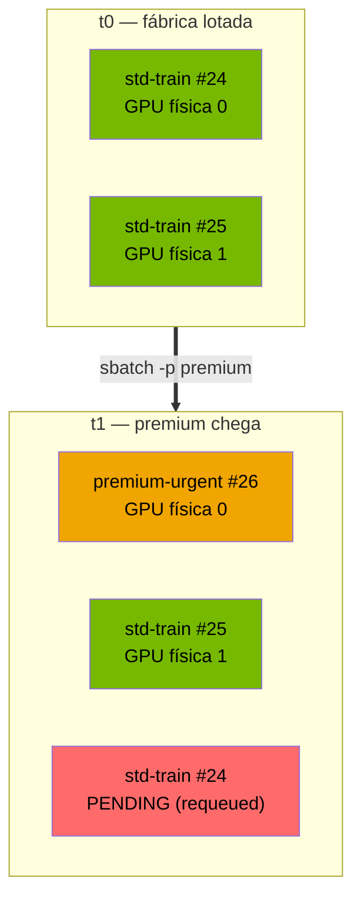

# Lab 03 — Multi-tenancy e preempção: SLA entre clientes numa GPU compartilhada

> O problema central de qualquer fábrica de IA: **mais gente querendo GPU do que GPU disponível**. Este lab mostra como o scheduler resolve isso quando os usuários não são iguais — quando existe um tier premium com SLA. Um job prioritário chega, o cluster **expulsa** um job comum da GPU, roda na frente, e o expulso **volta sozinho** para a fila sem se perder.

**O que este lab prova:** como modelar classes de serviço com partições Slurm, como a preempção por prioridade funciona na prática, por que `REQUEUE` é a única política que funciona quando o recurso escasso é GPU, e como auditar tudo depois.

Continuação do [Lab 02](02-gpu-gres-slurm.md) — o mesmo head node com `gres=gpu:2`.

---

## Cenário

Duas classes de cliente disputando as mesmas 2 GPUs:



| Tier | Partição | `PriorityTier` | Preemptável? |
|---|---|---|---|
| Cliente comum | `standard` | 1 | sim → requeue |
| Cliente prioritário | `premium` | 100 | **não** (`PreemptMode=OFF`) |

---

## Passo 1 — Escolher a política de preempção

O Slurm oferece três formas de preemptar. Para GPU, **duas delas não servem**:

| `PreemptMode` | O que faz | Serve aqui? |
|---|---|---|
| `SUSPEND` | Congela o job na memória | ❌ **Não** — o job suspenso **continua segurando a GPU**. O premium não teria onde rodar |
| `CANCEL` | Mata o job | ❌ Perde o trabalho do cliente comum |
| `REQUEUE` | Devolve o job à fila, libera o recurso | ✅ **Sim** |

Essa é a decisão de projeto mais importante do lab: **em GPU, suspender não libera nada.** Diferente de CPU/memória, onde `SUSPEND` é aceitável, aqui o recurso escasso permanece alocado ao job congelado.

---

## Passo 2 — Criar os tiers

Duas partições sobre o mesmo nó, mais a política global:

```ini
# slurm.conf  (em /cm/shared/apps/slurm/etc/slurm/slurm.conf)
PreemptType=preempt/partition_prio
PreemptMode=REQUEUE

PartitionName=standard Nodes=bcm11-headnode Default=NO PriorityTier=1   MaxTime=INFINITE State=UP
PartitionName=premium  Nodes=bcm11-headnode Default=NO PriorityTier=100 PreemptMode=OFF MaxTime=INFINITE State=UP
```

`PreemptMode=OFF` na partição `premium` é o que a torna **não preemptável** — um premium nunca é expulso por outro.

```bash
scontrol reconfigure
```

```
$ sinfo -o '%P %.10l %.6D %.6t %N'
PARTITION  TIMELIMIT  NODES  STATE NODELIST
defq*       infinite      1   idle bcm11-headnode
standard    infinite      1   idle bcm11-headnode
premium     infinite      1   idle bcm11-headnode

$ scontrol show config | grep PreemptType
PreemptType             = preempt/partition_prio
```

---

## Passo 3 — Lotar a fábrica com clientes comuns

Dois jobs `standard`, cada um pedindo 1 GPU. As 2 GPUs ficam ocupadas.

```bash
#SBATCH --job-name=std-train
#SBATCH --partition=standard
#SBATCH --gres=gpu:1
#SBATCH --requeue          # ← sem isto, o job seria CANCELADO em vez de devolvido à fila
echo "### tentativa numero: ${SLURM_RESTART_COUNT:-0} ###"
python3 treina.py --lr 0.05 --amostras 8000 --features 30 --epocas 120 --repeticoes 3
```

> **O trabalho é real.** `treina.py` treina uma regressão logística por descida de gradiente (Python puro, CPU) — não é `sleep`. Isso importa para a demonstração: o job preemptado **perde o progresso** e recomeça, que é exatamente o custo real de uma política de requeue.

```
$ squeue -o '%.6i %.13j %.9P %.2t %.9M %R'
 JOBID          NAME PARTITION ST      TIME NODELIST(REASON)
    24     std-train  standard  R      0:03 bcm11-headnode
    25     std-train  standard  R      0:03 bcm11-headnode
```

Nenhuma GPU livre.

---

## Passo 4 — O premium chega ★

```bash
sbatch --partition=premium --gres=gpu:1 job_premium.sh
```

Três segundos depois:

```
 JOBID           NAME PARTITION ST      TIME NODELIST(REASON)
    26 premium-urgent   premium  R      0:01 bcm11-headnode   ← entrou na frente
    24      std-train  standard PD      0:00 (BeginTime)      ← FOI EXPULSO
    25      std-train  standard  R      0:22 bcm11-headnode   ← seguiu rodando
```

O scheduler:
1. viu que não havia GPU livre para um job de tier 100;
2. escolheu **uma** vítima de tier 1 (só o necessário — o #25 continuou intocado);
3. requeuou o #24, liberando a GPU;
4. iniciou o premium.

> **Detalhe observado:** o motivo aparece como `(BeginTime)`, não `(Preempted)`. O Slurm segura o job requeued por um curto intervalo antes de reagendá-lo, e é esse *hold* que o `squeue` reporta. Procurar literalmente por "Preempted" na fila leva à conclusão errada de que a preempção não aconteceu.

E o premium herdou exatamente a GPU liberada:

```
$ grep "GPU física" logs/premium-urgent-26.out
GPU física: 0        ← a mesma que o #24 usava
```

---

## Passo 5 — O trabalho expulso não se perde

Terminado o premium (~21s), o `#24` voltou a rodar sozinho e concluiu:

```
$ scontrol show job 24 | grep -E 'JobState|Restarts|Requeue'
   JobState=COMPLETED Reason=None
   Requeue=1 Restarts=1 BatchFlag=1 ExitCode=0:0
```

**`Restarts=1` é a prova formal da preempção** — mais confiável que o estado transitório na fila, porque persiste após o job terminar. É o campo que se audita depois do incidente.

E como o job faz trabalho real, o próprio log mostra o reinício:

```
$ grep "tentativa numero" logs/std-train-*.out
logs/std-train-44.out:### tentativa numero: 1 ###     ← foi preemptado e recomeçou
logs/std-train-45.out:### tentativa numero: 0 ###     ← nunca foi tocado
```

> **O custo do requeue fica visível.** O `#44` treinou, foi expulso, perdeu o progresso e treinou de novo do zero. É a contrapartida honesta da política: nada se perde, mas trabalho é refeito. Com `SUSPEND` não haveria retrabalho — só que a GPU nunca seria liberada.

---

## Passo 6 — Contabilidade

```
$ sacct -S today --format=JobID,JobName%14,Partition,State,Elapsed
JobID               JobName  Partition      State    Elapsed
------------ -------------- ---------- ---------- ----------
24                std-train   standard  COMPLETED   00:01:10
25                std-train   standard  COMPLETED   00:01:10
26           premium-urgent    premium  COMPLETED   00:00:21
```

Os três terminaram. O premium foi atendido em 21 segundos apesar da fábrica estar lotada, e **nenhum trabalho comum foi descartado**. É exatamente o contrato que um tier de SLA promete.

---

## Relevância

| Conceito exercitado | AI Factory / NCA-AIIO |
|---|---|
| Partições com `PriorityTier` | classes de serviço / QoS por tenant |
| `preempt/partition_prio` | mecanismo de SLA entre clientes |
| `PreemptMode=REQUEUE` vs `SUSPEND` | por que GPU exige liberar, não congelar |
| `PreemptMode=OFF` na partição | proteger o tier de topo |
| `#SBATCH --requeue` | resiliência do trabalho preemptado |
| `Restarts` no `scontrol` | auditoria pós-incidente |
| `sacct` por partição | base de chargeback / showback |

Num cluster real, troque as 2 GPUs fake por 8× H100 e os `sleep` por PyTorch: **a lógica de escalonamento é idêntica**. É assim que um provedor entrega prioridade contratual sem dedicar hardware por cliente — o mesmo problema que plataformas comerciais de orquestração de GPU resolvem em Kubernetes.

---

## Armadilhas encontradas

| Sintoma | Causa | Correção |
|---|---|---|
| Job preemptado é **cancelado**, não requeued | falta `#SBATCH --requeue` no script | adicionar a diretiva |
| Premium fica `PENDING` mesmo com preempção ligada | `PreemptMode=SUSPEND` — o job suspenso segura a GPU | usar `REQUEUE` |
| `squeue` não mostra "Preempted" | Slurm reporta o *hold* como `(BeginTime)` | auditar por `Restarts` no `scontrol` |
| Partições somem após reconfigurar | o BCM é dono do `slurm.conf` e pode regenerá-lo | aplicar pouco antes do uso; manter o revert à mão |

---

## Notas e reversão

O BCM gerencia o `slurm.conf`. Este lab edita o arquivo diretamente, então **faça backup antes e reverta depois**:

```bash
cp /cm/shared/apps/slurm/etc/slurm/slurm.conf{,.bak}
```

Reverter = remover as duas linhas `PartitionName=` e as duas de `Preempt*`, depois:

```bash
scontrol reconfigure
```

Confirmação de que voltou ao estado limpo:

```
$ sinfo -o '%P %.6t %N'
PARTITION  STATE NODELIST
defq*       idle bcm11-headnode

$ scontrol show config | grep PreemptType
PreemptType             = (null)
```

> Em produção, o caminho correto seria criar as partições **pelo `cmsh`** (que sobrevive à regeneração do BCM) em vez de editar o arquivo. A edição direta é aceitável aqui por ser um lab efêmero, e tem a vantagem didática de deixar a configuração visível.
