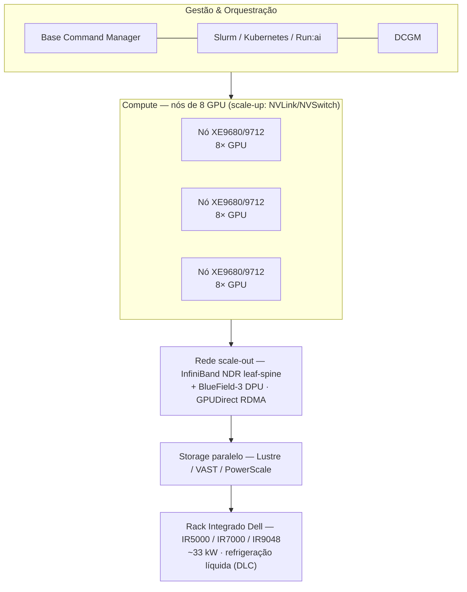
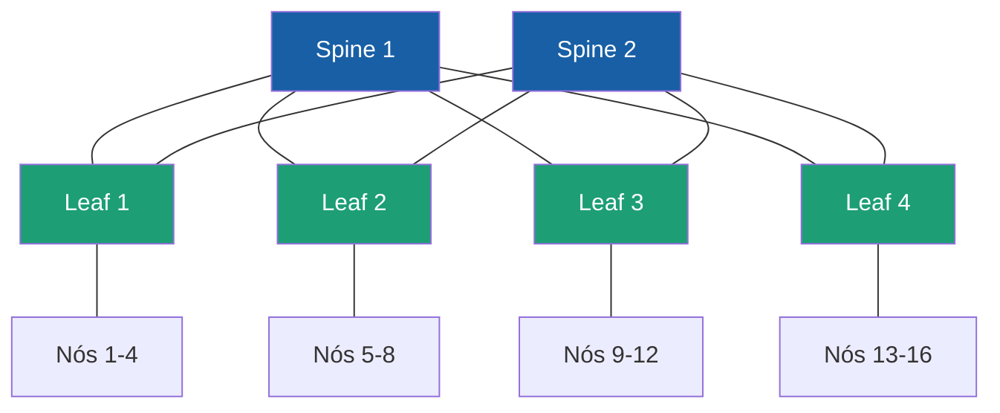
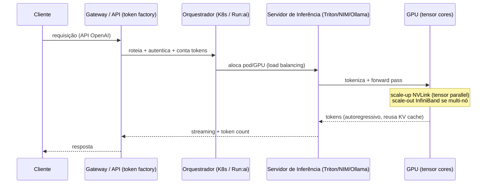

# Arquitetura de AI Factory — camadas, topologias e fluxo de inferência

Arquitetura de referência de uma AI Factory (estilo **NVIDIA DGX SuperPOD** + programa **Dell Integrated Rack**), os conceitos de rede e o fluxo de uma requisição de inferência. Cobre os domínios **AI Infrastructure (40%)** e **AI Operations (22%)**.

## Camadas (visão geral)



## Scale-up vs scale-out (o eixo central)
| | Scale-up | Scale-out |
|---|---|---|
| Onde | **Dentro do nó** | **Entre nós** |
| Tecnologia | **NVLink / NVSwitch** | **InfiniBand NDR (Quantum-2, 400 Gb/s)** |
| Banda | ~TB/s (all-to-all entre 8 GPUs) | 400 Gb/s por porta |
| Topologia | malha NVSwitch | **leaf-spine (fat-tree não-bloqueante)** |
| Acelerado por | — | **GPUDirect RDMA + BlueField DPU** |

## Topologia de rede — leaf-spine (fat-tree)


> Cada **leaf** conecta a **todos os spines** → qualquer GPU alcança qualquer outra em poucos saltos, com banda não-bloqueante. Para 256 GPUs: ~**8 leaf + 4 spine** (switches Quantum-2 de 64×400G).

## DGX SuperPOD — unidade de escala (SU)
Uma AI Factory é montada em blocos repetíveis:
- **1 Scalable Unit (SU)** = ~**32 nós × 8 GPU = 256 GPUs**, com seu próprio fabric InfiniBand.
- SUs são replicadas até **milhares de GPUs**.
- Na Dell, a SU pré-validada é o **Integrated Rack (IR5000/IR7000)** — você compra o rack pronto, não monta peça a peça.

## Fluxo de uma requisição de inferência



**No AI Factory local (1 GPU):** `Console (:8088) → Ollama (:11434) → GPU RTX 3050 → tokens + contagem`. É o mesmo fluxo, sem as etapas de scale-out.

## Exemplos de configuração (deste repositório)

**GPU time-slicing** (1 GPU → N fatias agendáveis) — `../ai-factory/k8s/01-timeslicing-config.yaml`:
```yaml
sharing:
  timeSlicing:
    resources:
    - name: nvidia.com/gpu
      replicas: 4
```
> ⚠️ Time-slicing **não isola** memória nem fault-domain (se um workload crasha, todos crasham). Para isolamento real → **MIG** (GPUs de datacenter).

**Gateway "token factory"** (API OpenAI na frente do Ollama) — `../ai-factory/k8s/04-litellm.yaml`:
```yaml
model_list:
  - model_name: qwen
    litellm_params:
      model: ollama/qwen2.5:1.5b
      api_base: http://ollama:11434
```

**Mapa: arquitetura → servidor XE → domínio da prova**
| Camada | Tecnologia | Servidor/Dell | Domínio |
|---|---|---|---|
| Compute | 8× GPU SXM / Grace-Blackwell | XE9680/9712 | AI Infra (hardware) |
| Scale-up | NVLink/NVSwitch | embutido SXM | AI Infra (interconnect) |
| Scale-out | InfiniBand NDR leaf-spine | CX8 OSFP (XE9712/9780) | AI Infra (networking) |
| DPU | BlueField-3 | BF3 SuperNIC | AI Infra (DPU) |
| Storage | FS paralelo | PowerScale/PowerVault | AI Infra (storage) |
| Orquestração | Slurm/K8s/Run:ai | — | AI Operations |
| Gestão/Monitor | BCM + DCGM + iDRAC | iDRAC10 | AI Operations |
| Rack/energia | IR5000/7000, DLC | Integrated Rack | AI Infra (power/cooling) |
